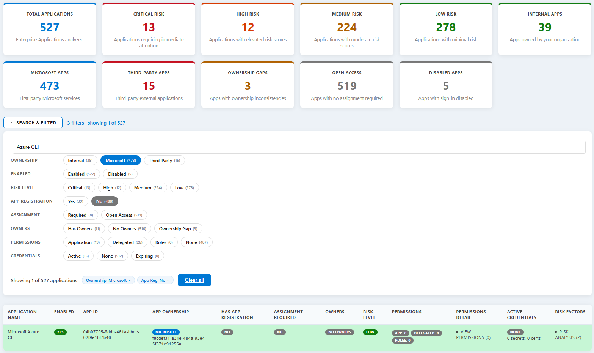

# Entra ID App Report

Generates an interactive, self-contained HTML security report for all Enterprise Applications (Service Principals) in a Microsoft Entra ID tenant. Designed for security reviews, governance audits, and weekly automated reporting via Azure DevOps.

## What it does

The script connects to Microsoft Graph, retrieves every Enterprise Application registered or consented to in the tenant, and analyses each one across several dimensions:

- **Permissions**: application permissions (app roles) and delegated permissions (OAuth2 grants), including the resource they are granted against
- **Consent type**: each delegated permission is tagged as tenant-wide **Admin Consent** or self-service **User Consent**, with a per-user consent count shown for user-consented permissions (mirroring the Entra portal's Permissions > User consent view)
- **Directory roles**: Entra ID directory roles assigned directly to the service principal
- **Ownership**: owners on both the Service Principal and its backing App Registration, with gap detection when the two ownership sets diverge; owners are tracked separately for the Enterprise App and the App Registration
- **Credentials**: active certificates and client secrets on the App Registration counted separately, including expiry detection within 30 days, already-expired credential detection, and long-lived credential detection
- **Publisher verification**: whether a third-party (external) app has a Microsoft-verified publisher
- **High-value target apps**: flags well-known first-party admin/automation apps (Azure CLI, Azure/Azure AD PowerShell, Exchange Online PowerShell, Microsoft Graph CLI/PowerShell) that are open to all users
- **Risk scoring**: a weighted score per app based on the above signals, producing a Critical / High / Medium / Low classification
- **Governance signals**: whether assignment is required, whether the app is enabled or disabled, whether it is internal, Microsoft-owned, or third-party

The output is a single `.html` file that works offline with no external dependencies and no server required.

## Report features

| Feature | Detail |
|---------|--------|
| Summary cards | Clickable cards for total apps, risk levels, ownership type, unverified publishers, expiring credentials, ownership gaps, and disabled apps, each filtering the table |
| Search | Debounced real-time text search across application name, App ID, owner, and permission |
| Filter panel | Multi-dimensional filter tags for enabled state, ownership, publisher verification, App Registration, assignment, owners, risk, permissions, consent type, and credentials |
| Column sort | Click any sortable column header to sort ascending; click again to reverse |
| Export CSV | Downloads the currently visible (filtered) rows as a `.csv` file, UTF-8 with BOM for correct Excel rendering |
| Dark / light mode | Toggle persisted to `localStorage`; a GitHub repo link icon sits next to the toggle in the header |
| Portal deep links | Application name links directly to the Entra portal entry for that app |
| Detail modals | Clickable badges throughout the report open a detail panel with full information — see [Interactive badges](#interactive-badges) |
| Risk score visual scale | The Risk Analysis modal shows a segmented threshold bar (Low/Medium/High/Critical) with a marker at the app's actual score; disabled apps show a muted grey badge/gauge and a status banner instead of full color, since the score reflects inherent (not currently exploitable) risk |

## Example



## Interactive badges

Most badges in the report table are clickable and open a detail modal with additional information. Badges that only act as filters (Enabled, App Registration, Assignment Required) are not modal triggers. Modal tables (Certificates, Secrets, Expiring, Expired, and Owners) are sortable — click any column header to sort ascending, click again to reverse.

| Column | Badge | Modal content |
|--------|-------|---------------|
| App Ownership | Internal / Microsoft / Third-Party | Ownership type, publisher verification (third-party only), and owner tenant ID |
| App Ownership | Verified Publisher / Unverified Publisher | Shown under the Third-Party badge only. Opens the same App Ownership modal as the Third-Party badge |
| Permissions | App: N | Full list of application permissions with resource; each permission links to the Graph Permissions Explorer |
| Permissions | Delegated: N | Full list of delegated permissions with resource; each permission links to the Graph Permissions Explorer. Each entry also shows a consent badge — **Admin Consent** (tenant-wide) or **N user(s) consented** (self-service) — that filters the table by consent type when clicked |
| Permissions | Roles: N | Full list of directory roles assigned to the service principal; each role links to the Microsoft Learn built-in roles reference |
| Risk | Critical / High / Medium / Low | A score header (large point total plus the risk-level badge) followed by every contributing signal, sorted highest-to-lowest with individual point values, and a visual threshold scale bar showing where the score falls between Low/Medium/High/Critical; permission factors link to the Graph Permissions Explorer, directory-role factors link to Microsoft Learn, the two "Assignment not required" factors and the unverified-publisher factor link to the relevant Microsoft Learn article, and some factors carry a hover tooltip (rendered as a small info icon) with extra guidance. For disabled apps, the badge and gauge are shown in muted grey with a banner explaining the score reflects inherent risk only |
| Credentials | Certs: N | Sortable table of each active certificate: display name, valid from, expiry date (highlighted if expiring/expired), and Key ID |
| Credentials | Secrets: N | Sortable table of each active client secret: display name, created date, expiry date (highlighted if expiring/expired), and Key ID |
| Credentials | Expiring: N | Sortable table of only the certificates/secrets expiring within 30 days, across both types |
| Credentials | Expired: N | Sortable table of only the certificates/secrets that have already expired, across both types |
| Owners | N owner(s) | Sortable table of all owners with their coverage (Enterprise App, App Registration, or both) |
| Owners | Ownership Gap | Owners that are not assigned to both the Service Principal and the App Registration |
| Owners | No owners | Plain badge — no modal |

## Prerequisites

### PowerShell version

PowerShell 5.1 or PowerShell 7+. Both are supported; the script is tested on both.

### Microsoft Graph modules

The following modules are required at version 2.0.0 or later:

```powershell
@(
    'Microsoft.Graph.Authentication',
    'Microsoft.Graph.Applications',
    'Microsoft.Graph.Identity.SignIns',
    'Microsoft.Graph.Identity.DirectoryManagement',
    'Microsoft.Graph.Users'
) | ForEach-Object {
    Install-Module -Name $_ -MinimumVersion '2.0.0' -Scope CurrentUser -AllowClobber
}
```

Or install the full umbrella module:

```powershell
Install-Module -Name Microsoft.Graph -MinimumVersion '2.0.0' -Scope CurrentUser -AllowClobber
```

### Entra ID permissions

The identity used to run the script (user, service principal, or managed identity) needs the following **Microsoft Graph application permissions** with admin consent:

| Permission | Purpose |
|------------|---------|
| `Application.Read.All` | Read service principals and app registrations |
| `Directory.Read.All` | Read directory objects and owners |
| `DelegatedPermissionGrant.Read.All` | Read OAuth2 delegated permission grants |
| `RoleManagement.Read.Directory` | Read directory role assignments |

For **interactive (user) runs**, these are requested as delegated scopes during the sign-in browser prompt.

## Parameters

| Parameter | Type | Default | Description |
|-----------|------|---------|-------------|
| `-OutputPath` | String | Auto-generated | Path for the HTML report. Defaults to `EntraIDAppReport__{TenantName}_{Date}.html` in the current directory. |
| `-TenantId` | String | None | Entra ID tenant ID. Required for Service Principal authentication. Used when targeting a specific tenant. |
| `-AccessToken` | SecureString | None | Pre-acquired Microsoft Graph token. Used in Azure DevOps pipelines via `Get-AzAccessToken`. |
| `-ClientId` | String | None | App (client) ID for Service Principal authentication. Must be combined with `-CertificateThumbprint` and `-TenantId`. |
| `-CertificateThumbprint` | String | None | Certificate thumbprint for Service Principal authentication. |
| `-UseManagedIdentity` | Switch | None | Authenticate using the Managed Identity of the hosting environment (Azure VM, Function, DevOps hosted agent). |
| `-NonInteractive` | Switch | None | Suppress all prompts and skip automatic browser launch. Required for unattended or pipeline runs. |
| `-OnlyWithPermissions` | Switch | None | Include only apps that have at least one permission (delegated, application, or directory role). |
| `-MinimumPermissions` | Int | `0` | Include only apps with a total permission count at or above this threshold. |
| `-RiskConfigPath` | String | None | Path to a JSON file that overrides the built-in risk scoring rules. See [Custom risk configuration](#custom-risk-configuration). |
| `-OnlyWithAppRegistrations` | Switch | None | Include only apps that have a corresponding App Registration in this tenant. Mutually exclusive with `-OnlyServicePrincipals`. |
| `-OnlyServicePrincipals` | Switch | None | Include only service principals without an App Registration (gallery apps, legacy apps). Mutually exclusive with `-OnlyWithAppRegistrations`. |
| `-DryRun` | Switch | None | Run the full analysis but skip writing the report to disk and skip opening the browser. Useful for testing auth and parameters. |

## Manual usage

### Interactive sign-in (default tenant)

```powershell
.\Get-EntraIDAppReport.ps1
```

A browser window opens for Microsoft sign-in. The report is saved to the current directory and opened automatically when complete.

### Interactive sign-in for a specific tenant

Use this when you need to target a specific Entra ID tenant:

```powershell
.\Get-EntraIDAppReport.ps1 -TenantId "xxxxxxxx-xxxx-xxxx-xxxx-xxxxxxxxxxxx"
```

The sign-in prompt will target the specified tenant.

### Service Principal with certificate

```powershell
.\Get-EntraIDAppReport.ps1 `
    -TenantId "xxxxxxxx-xxxx-xxxx-xxxx-xxxxxxxxxxxx" `
    -ClientId "yyyyyyyy-yyyy-yyyy-yyyy-yyyyyyyyyyyy" `
    -CertificateThumbprint "ABCDEF1234567890ABCDEF1234567890ABCDEF12" `
    -NonInteractive `
    -OutputPath "C:\Reports\EntraReport.html"
```

The certificate must be installed in the current user's or local machine's certificate store.

### Managed Identity

```powershell
.\Get-EntraIDAppReport.ps1 -UseManagedIdentity -NonInteractive -OutputPath ".\report.html"
```

### Filter to high-signal apps only

```powershell
# Only apps that have at least one permission
.\Get-EntraIDAppReport.ps1 -OnlyWithPermissions

# Only apps with 5 or more permissions
.\Get-EntraIDAppReport.ps1 -MinimumPermissions 5

# Only apps that have an App Registration in this tenant
.\Get-EntraIDAppReport.ps1 -OnlyWithAppRegistrations
```

### Dry run (validate auth without writing a file)

```powershell
.\Get-EntraIDAppReport.ps1 -DryRun -Verbose
```

## Risk scoring

Every app receives a numeric risk score. The score drives the **Critical / High / Medium / Low** classification shown in the report.

### Thresholds

| Level | Score range |
|-------|-------------|
| Low | 0 to 14 |
| Medium | 15 to 34 |
| High | 35 to 49 |
| Critical | 50 and above |

### Scoring factors

| Signal | Points |
|--------|--------|
| High-value app open to all users (assignment not required) — Azure CLI, Azure/Azure AD PowerShell, Exchange PowerShell, Graph CLI/PowerShell | +50 |
| Each unique high-risk directory role (e.g. Global Administrator, Security Administrator) | +15 |
| Each unique high-risk permission (e.g. `Directory.ReadWrite.All`, `Directory.Read.All`, `User.ReadWrite.All`) | +15 |
| Each unique medium-risk permission (e.g. `User.Read.All`, `Mail.Send`) | +5 |
| Each other directory role | +5 |
| Has any application permissions (bonus, counted once) | +5 |
| Sensitive permission granted via Admin Consent, tenant-wide (all users exposed) | +5 |
| Assignment not required (open access, non high-value app) | +5 |
| Uses password secrets instead of certificates | +5 |
| Multiple secrets configured | +5 |
| Long-lived credentials (expiry > 1 year) | +5 |
| External application (registered in another tenant, not Microsoft) | +5 |
| External application without a Microsoft-verified publisher | +5 |
| No owners on either Service Principal or App Registration | +4 |
| Sensitive permission granted via User Consent, no admin review (governance blind spot) — flat, regardless of how many users consented | +3 |
| No Service Principal owners (App Registration owners only) | +2 |
| No App Registration owners (Service Principal owners only) | +2 |
| Suspicious keyword in display name (e.g. `test`, `admin`, `temp`, `legacy`) | +2 |
| Ownership gap (SP and App Reg owner sets differ) | +1 |

Notes:

- The high-value factor (+50) and the generic "assignment not required" factor (+5) are mutually exclusive — a high-value app records only the single higher factor.
- An external, unverified third-party app accumulates both the external (+5) and unverified-publisher (+5) factors.
- The Admin Consent (+5) and User Consent (+3) factors are independent and can both apply to the same app if it has some permissions consented tenant-wide and others consented individually by users.
- Disabled apps keep their full inherent score and are not counted differently in scoring — the disabled state is shown only as a modal banner and muted color, not as a scoring factor. See [Disabled app handling](#disabled-app-handling).

### High-value target apps

A small set of first-party command-line / automation apps are common targets for token theft, illicit consent, and lateral movement, and most users never need them. When one of these apps does **not** require assignment (open to every user in the tenant), it is scored +50 — enough to reach **Critical** on its own.

The list is defined in the script as `$script:HighValueTargetApps` and can be extended. It currently contains:

| App | App ID |
|-----|--------|
| Microsoft Azure CLI | `04b07795-8ddb-461a-bbee-02f9e1bf7b46` |
| Azure PowerShell | `1950a258-227b-4e31-a9cf-717495945fc2` |
| Azure Active Directory PowerShell | `1b730954-1685-4b74-9bfd-dac224a7b894` |
| Exchange Online PowerShell | `fb78d390-0c51-40cd-8e17-fdbfab77341b` |
| Microsoft Graph Command Line Tools | `14d82eec-204b-4c2f-b7e8-296a70dab67e` |
| Microsoft Graph PowerShell | `09abbdfd-ed23-44ee-a2d9-a627aa1c90f3` |

### Disabled app handling

Disabled apps (`AccountEnabled = false`) keep their full inherent risk score. A disabled app can be re-enabled with a single admin toggle, so an over-privileged dormant app is still a real risk. No factor is added to the list for this; instead, the Risk Analysis modal shows a status banner explaining the app is currently disabled and that the score reflects inherent risk if re-enabled, and mutes the risk badge/gauge color to grey. The main table row, its Risk Level badge, and the **Enabled** column / filter are unaffected and still indicate current exploitability.

## Custom risk configuration

You can override the built-in permission lists, role lists, and suspicious keywords by supplying a JSON file:

```powershell
.\Get-EntraIDAppReport.ps1 -RiskConfigPath ".\my-risk-config.json"
```

The file must be valid JSON with all four required keys:

```json
{
    "HighRiskPermissions": [
        "Directory.ReadWrite.All",
        "Directory.Read.All",
        "User.ReadWrite.All"
    ],
    "MediumRiskPermissions": [
        "User.Read.All",
        "Mail.Read"
    ],
    "HighRiskDirectoryRoles": [
        "Global Administrator",
        "Security Administrator"
    ],
    "SuspiciousKeywords": [
        "test", "temp", "legacy", "admin"
    ]
}
```

If the file is missing any of the four keys, the script falls back to the built-in defaults and logs a warning. The file must exist at the path provided; the parameter validates this at startup.

> The high-value target app list (`$script:HighValueTargetApps`) and the Microsoft first-party tenant IDs are defined directly in the script, not in this JSON file. Edit the script to change them.

## Azure DevOps pipeline

The included `azure-pipelines.yml` automates weekly report generation using a federated Azure service connection. No secrets or passwords are stored in ADO.

### How it works

1. The pipeline runs on a schedule (every Monday at 06:00 UTC) and on every push to `main`.
2. The `AzurePowerShell@5` task authenticates using the ADO service connection (`azureSubscription`). The service connection uses **Workload Identity Federation**. The Azure service principal behind it is granted the required Graph permissions.
3. The task obtains a Graph access token from the authenticated Az context and passes it to the script via `-AccessToken`.
4. The HTML report is saved to `$(Build.ArtifactStagingDirectory)` and published as a pipeline artifact named `EntraIDAppReport`.

### Setup steps

**1. Create an Azure service connection in ADO**

In your ADO project: **Project Settings → Service Connections → New service connection → Azure Resource Manager**.

Select **Workload Identity Federation** as the authentication method. The connection does not need any Azure subscription role. It only needs Entra ID Graph permissions.

**2. Grant the service principal Graph permissions**

Find the service principal created for your service connection in Entra ID (**App registrations** or **Enterprise applications**) and add these **Application permissions** with admin consent:

- `Application.Read.All`
- `Directory.Read.All`
- `DelegatedPermissionGrant.Read.All`
- `RoleManagement.Read.Directory`

**3. Update the pipeline file**

Edit `azure-pipelines.yml` and set `azureSubscription` to the name of your service connection:

```yaml
azureSubscription: "Your-Service-Connection-Name"
```

**4. Run or schedule**

Push to `main` to trigger immediately, or let the Monday schedule run automatically. The report artifact is available under the pipeline run's **Artifacts** tab.

### Schedule

```yaml
schedules:
  - cron: "0 6 * * 1"   # Every Monday at 06:00 UTC
    always: true          # Run even if no code changes
```

To change the schedule, update the `cron` expression. To disable the schedule and run on push only, remove the `schedules` block.

### Pipeline output

The artifact `EntraIDAppReport` contains:

```
EntraIDAppReport__{TenantName}_YYYY-MM-DD.html
```

Download the artifact from the pipeline run, open the HTML file in any browser. No internet connection is required.

## File reference

| File | Purpose |
|------|---------|
| `Get-EntraIDAppReport.ps1` | Main script |
| `azure-pipelines.yml` | Azure DevOps pipeline definition |

## Author

[Matej Klemencic](https://www.matej.guru)
